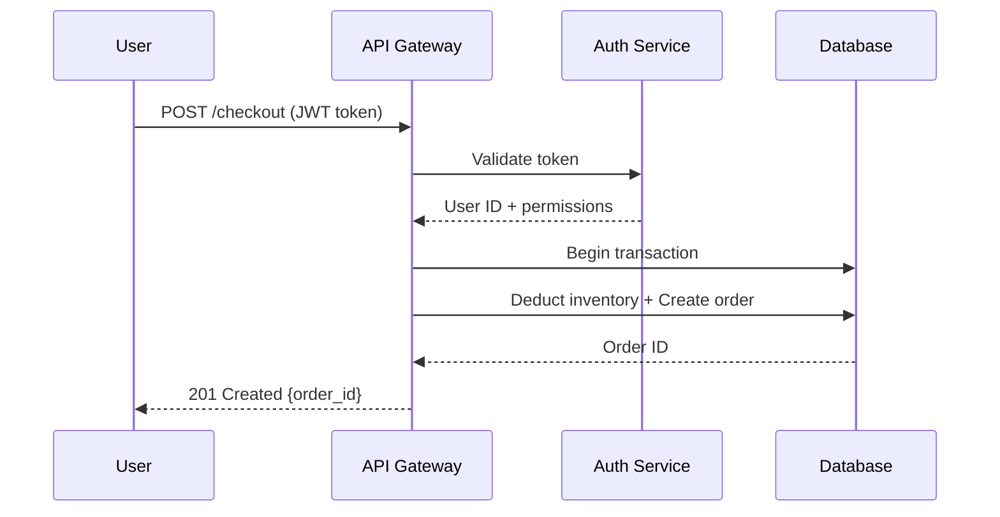

{/* ═══════════════════════════════════════════════════════════════════════════
    INSTRUCTIONS FOR SETUP
    ───────────────────────
    1. Copy RoadmapNav.tsx → components/RoadmapNav.tsx
    2. Add three lines to components/MDXComponents.tsx (see MDXComponents.tsx file)
    3. Copy this file → data/blog/software-engineering-roadmap.mdx
    4. Done — no other changes needed.
    ═══════════════════════════════════════════════════════════════════════════ */}

<RoadmapNav />

{/* ╔══════════════════════════════════════════════════════════════════╗
    ║  MODULE 01 — ENGINEERING FOUNDATIONS                            ║
    ╚══════════════════════════════════════════════════════════════════╝ */}

<ModuleSection id="m01">

> **Before you design systems or deploy to the cloud, you need bedrock.** These six areas aren't just prerequisites — they're the cognitive tools you'll reach for every day for the rest of your career.

## 📍 Module Overview

| Property | Value |
|---|---|
| Phase | Months 1–3 |
| Topics | 6 |
| Primary Tools | Python or TypeScript · PostgreSQL · Linux · Git |
| Key Mindset Shift | *"How do I code this?"* → *"What is the shape of this problem?"* |

---

## 01 · Data Structures & Algorithms

DSA is the grammar of engineering — not for interviews, but for pattern recognition. When you truly internalize it, you stop asking *"how do I code this?"* and start asking *"what is the shape of this problem?"*

> 💡 **The Right Mindset:** Every data structure is a tradeoff between speed, memory, and flexibility. Ask: *"What operations do I need to be fast?"* The answer determines the structure.

### Big-O: Cost Before Code

<BigOVisual />

### Core Data Structures

<DataStructuresTable />

### Algorithm Patterns

Don't memorize algorithms. Recognize patterns. Almost every problem maps to one of these six.

<AlgorithmPatterns />

```python
# Two Pointers — O(n) instead of naive O(n²)
def has_pair_with_sum(arr: list[int], target: int):
    """Find if any two numbers sum to target. Requires sorted input."""
    left, right = 0, len(arr) - 1
    while left < right:
        total = arr[left] + arr[right]
        if total == target:  return (left, right)
        elif total < target: left += 1
        else:                right -= 1
    return None
```

> 💡 **Study Tip:** Don't grind 200 LeetCode problems. Solve 50 well. After each: write down the pattern, explain the complexity, solve it again from scratch. Depth beats breadth.

---

## 02 · Computational Thinking

<ComputationalThinkingPillars />

### The 7-Step Problem-Solving Framework

| Step | Action | Why |
|---|---|---|
| 01 | **Understand, don't assume** | Restate the problem. What are the inputs? Outputs? Edge cases? |
| 02 | **Explore concrete examples** | Trace 2–3 examples by hand. Simple cases first, then edge cases. |
| 03 | **Identify the pattern** | Name the category before reaching for code. |
| 04 | **Design before typing** | 5 minutes of pseudocode saves 50 minutes of debugging. |
| 05 | **Implement incrementally** | Simplest working version first. Slow-correct beats fast-wrong. |
| 06 | **Verify and stress-test** | Empty input? n=1? Enormous n? |
| 07 | **Analyze and reflect** | State the Big-O. What would you change? Reflection compounds. |

> ⚠️ **Common Mistake:** Jumping straight to code is the #1 mistake junior engineers make. The keyboard is not where thinking happens.

---

## 03 · Programming Depth

Pick Python or TypeScript. Go deep, not wide. Master one — the rest follow much faster.

<ProgrammingConcepts />

```python
# ❌ Opaque — reader must decode every symbol
def f(d, t):
    r = []
    for x in d:
        if x['ts'] > t: r.append(x)
    return r

# ✓ Expressive — reads like a sentence
def filter_recent_events(
    events: list[Event],
    cutoff_timestamp: int
) -> list[Event]:
    """Return events newer than the cutoff timestamp."""
    return [e for e in events if e.timestamp > cutoff_timestamp]
```

---

## 04 · Databases & Storage

> 💡 **Core Philosophy:** Design backwards from your queries. What reads are most frequent? What writes? This determines schema, indexes, and whether you need SQL, NoSQL, or a mix.

### CAP Theorem


### When not to use SQL

| Store Type | Examples | Use When |
|---|---|---|
| Document | MongoDB, CouchDB | Flexible, nested, schema-less data |
| Key-Value | Redis, DynamoDB | Sessions, caching, simple lookups |
| Column-family | Cassandra, HBase | Time-series, massive write throughput |
| Graph | Neo4j, Neptune | Relationship-heavy traversal queries |
| Vector | Pinecone, pgvector | Semantic search, ML embeddings |

```sql
-- Design for your most common queries first
WITH recent_orders AS (
    SELECT customer_id, SUM(total) AS revenue
    FROM orders
    WHERE created_at >= NOW() - INTERVAL '90 days'
      AND status = 'completed'
    GROUP BY customer_id
)
SELECT c.name, c.email, ro.revenue
FROM recent_orders ro
JOIN customers c ON c.id = ro.customer_id
ORDER BY ro.revenue DESC
LIMIT 5;

-- Then: EXPLAIN ANALYZE this. Is it using the index on created_at?
```

---

## 05 · Networking Fundamentals

### What happens when you type a URL and press Enter?

```
1.  Browser checks DNS cache for IP address
2.  DNS resolution: recursive resolver → root → TLD → authoritative → IP
3.  TCP 3-way handshake (SYN → SYN-ACK → ACK)
4.  TLS handshake: negotiate cipher, exchange certs, derive session keys
5.  Browser sends HTTP GET request
6.  Request hits load balancer → routes to app server
7.  App server processes, queries DB, builds response
8.  HTTP response sent back (200 OK + body)
9.  Browser renders / client parses the response
10. Connection kept alive (HTTP/1.1 keep-alive, HTTP/2 multiplexing)

Know each step. Every one can fail. Every one can be optimized.
```

<NetworkingConcepts />

---

## 06 · Linux & the Command Line

> ⚠️ **The Scenario:** SSH into a broken production server at 2am. No GUI. No IDE. Just a terminal and your knowledge. Prepare now.

```bash
# Log investigation — most critical production skill
tail -f /var/log/app/error.log         # live log stream
journalctl -u myapp -n 100             # last 100 lines
grep -A5 -B5 "Exception" app.log       # context around errors

# Disk & network
df -h                                  # full disk = silent failures
ss -tlnp                               # what ports are listening?
curl -v https://api.example.com/health # verbose HTTP check
```

<LinuxCommands />

---

## 🛠 Practice Projects

**Project 1 — DSA Task Scheduler:** Build a scheduler using a heap, hash map, and queue. Implement MinHeap from scratch. Write tests that verify Big-O behavior with timing.

**Project 2 — CLI Tool:** Build something useful (CSV processor, log analyzer). Full type hints, >80% test coverage, every error path handled. Write a README as if a stranger will use it.

**Project 3 — REST API + Database:** CRUD API with PostgreSQL. Correct HTTP verbs and status codes. EXPLAIN ANALYZE your most important queries.

**Project 4 — Linux Server:** Spin up a free VM. Install Nginx. Create a non-root user, disable root SSH. Write a cron job for disk monitoring. Simulate a failure and diagnose from logs.

---

## ✅ Mastery Checklist

<FoundationsChecklist />

</ModuleSection>

{/* ╔══════════════════════════════════════════════════════════════════╗
    ║  MODULE 02 — SYSTEMS DESIGN                                     ║
    ╚══════════════════════════════════════════════════════════════════╝ */}

<ModuleSection id="m02">

> **System design is engineering's most transferable skill.** It's how you think at scale — anticipating failure, bottlenecks, and tradeoffs *before* writing a single line of code. Every decision has a cost. A great engineer knows what cost they're paying.

## 📍 Module Overview

| Property | Value |
|---|---|
| Phase | Months 3–6 |
| Prerequisite | Module 01 — Engineering Foundations |
| Core Topics | 6 |
| Key Mindset Shift | *"Make it work"* → *"Make it work at 100x scale with graceful failure"* |

---

## 🧠 The Systems Thinker's Mindset

```
JUNIOR ENGINEER sees:         SYSTEMS ENGINEER sees:
  "I need to store user data"   "What's the read/write ratio?
                                 How many users? In 2 years?
                                 What's acceptable latency?
                                 What happens when the DB is slow?"
```

Every production system is eventually more traffic than designed for, running on hardware that fails, used in ways nobody anticipated, maintained by engineers who weren't there when it was built. Design for that reality from the start.

---

## 01 · The 7-Step Design Framework

<DesignFramework />

### Back-of-envelope estimation

```
URL SHORTENER — estimating scale
Assumptions: 100M DAU, read:write ratio = 10:1

Writes: 10M/day → 116 writes/sec → 350 peak
Reads:  100M/day → 1,160 reads/sec → 3,500 peak ← hot path
Storage: 18.25B records × 500B = 9TB over 5 years

Conclusions:
  → Reads >> Writes — optimise read path aggressively
  → Cache hot URLs in Redis (expect 90% hit rate)
  → Single DB handles writes; read replicas needed
```

---

## 02 · Core Tradeoffs

Strong engineers don't find "the right answer" — they find the right answer *for this context*.

> ⚠️ **After every design decision:** "By choosing X, I'm accepting Y." If you can't complete that sentence, you don't understand the tradeoff yet.

<TradeoffExplorer />

### Non-Functional Requirements

| NFR | Measured By | Typical Target | How to Achieve |
|---|---|---|---|
| Availability | Uptime % | 99.9% = 8.7h/yr downtime | Redundancy, health checks, auto-restart |
| Latency | p50/p95/p99 ms | p99 < 200ms for APIs | Caching, CDN, async processing |
| Throughput | Requests/sec | Depends on scale | Horizontal scaling, load balancing |
| Durability | Data loss tolerance | 0 data loss for financial | Replication, backups, WAL |
| Scalability | Growth headroom | 10× current load | Stateless services, sharding |

---

## 03 · Distributed Systems

> ⚠️ **The 8 Fallacies of Distributed Computing:** The network is reliable · Latency is zero · Bandwidth is infinite · The network is secure · Topology doesn't change · There is one administrator · Transport cost is zero · The network is homogeneous. Design around every one of these.

<DistributedConceptsGrid />

```python
# The 3 questions for every distributed operation:

# 1. What if the network drops mid-request?
def transfer_right(from_acc, to_acc, amount):
    txn_id = generate_uuid()
    with transaction(txn_id):
        debit(from_acc, amount)
        credit(to_acc, amount)
    # Safe to retry — duplicate txn_id is a no-op

# 2. What if two nodes do the same thing simultaneously?
# Optimistic lock: only succeeds if version matches
UPDATE inventory
   SET qty = :qty, version = version + 1
 WHERE id = :id AND version = :expected_version

# 3. What if a downstream service is slow?
circuit_breaker = CircuitBreaker(
    failure_threshold=5,
    recovery_timeout=30,
    fallback=lambda: cached_response()
)
```

---

## 04 · Caching

> 💡 **Phil Karlton:** "There are only two hard things in Computer Science: cache invalidation and naming things." This is funny because it's true.

<CachingStrategies />

```python
# Redis caching with stampede protection + TTL jitter
def get_user_profile(user_id: str) -> dict:
    cached = redis.get(f"user:{user_id}")
    if cached: return json.loads(cached)

    lock = redis.set(f"lock:user:{user_id}", "1", nx=True, ex=5)
    if lock:
        try:
            profile = db.query("SELECT * FROM users WHERE id = %s", user_id)
            ttl = 3600 + random.randint(-360, 360)  # jitter prevents mass expiry
            redis.setex(f"user:{user_id}", ttl, json.dumps(profile))
            return profile
        finally:
            redis.delete(f"lock:user:{user_id}")
    else:
        time.sleep(0.1)
        return get_user_profile(user_id)
```

---

## 05 · Security

> ⚠️ Security isn't a feature you add later — it's a perspective you embed from day one. Threat modelling happens at the whiteboard, not in a penetration test after launch.

| | Authentication (AuthN) | Authorization (AuthZ) |
|---|---|---|
| Question | *"Who are you?"* | *"What can you do?"* |
| Methods | Passwords, OAuth2, SSH keys, MFA | RBAC, ABAC, ACLs, policies |
| Order | **Always first** | **Always second** |

<SecurityConceptsGrid />

---

## 06 · Observability

> 💡 **The Three Pillars:** Metrics tell you *something is wrong*. Logs tell you *what happened*. Traces tell you *where the time went*. You need all three.

<ObservabilityPillars />

### The Four Golden Signals (Google SRE)

| Signal | What It Measures | Why It Matters |
|---|---|---|
| **Latency** | Time to serve a request (p50/p95/p99) | Directly impacts user experience |
| **Traffic** | Volume of demand (QPS) | Capacity planning, anomaly detection |
| **Errors** | Rate of failing requests (5xx) | Most direct user-impact signal |
| **Saturation** | How "full" the service is (CPU %, queue depth) | Leading indicator — alerts before breakage |

---

## 🛠 Design Exercises

**Exercise 1 — URL Shortener:** Focus on hash function choice, redirect latency, analytics counting without blocking redirects.

**Exercise 2 — Twitter Feed:** The fan-out problem. How do you handle celebrities with 100M followers? Push vs pull tradeoff.

**Exercise 3 — Rate Limiter:** Token bucket vs sliding window. Distributed rate limiting across multiple app servers.

**Exercise 4 — Notification System:** Multi-channel (email, SMS, push). Priority queues. Deduplication. Retry with backoff.

---

## ✅ Mastery Checklist

<SystemsDesignChecklist />

</ModuleSection>

{/* ╔══════════════════════════════════════════════════════════════════╗
    ║  MODULE 03 — CLOUD ENGINEERING                                  ║
    ╚══════════════════════════════════════════════════════════════════╝ */}

<ModuleSection id="m03">

> **The cloud isn't a hosting provider — it's a way of building.** Learn to think in terms of managed services, auto-scaling, pay-per-use, and infrastructure as code. Owning servers is legacy thinking.

## 📍 Module Overview

| Property | Value |
|---|---|
| Phase | Months 4–8 |
| Prerequisite | Modules 01–02 (Foundations + Systems Design) |
| Core Topics | 6 |
| Primary Tools | AWS / GCP / Azure · Docker · Kubernetes · Terraform · GitHub Actions |
| Key Mindset Shift | *"I provision infrastructure"* → *"I declare desired state"* |

---

## 🧠 The Cloud-First Mental Model

| Old Thinking | Cloud Thinking |
|---|---|
| "I need a server" | "I need compute for this workload" |
| "SSH in and configure it" | "Declare desired state as code" |
| "Deployment = FTP to a server" | "Deployment = triggering a pipeline" |
| "Scaling = bigger machine" | "Scaling = changing a number in config" |
| "DR = manual backup" | "DR = `terraform apply`" |

---

## 01 · Cloud Fundamentals

| Model | You Manage | Provider Manages | Examples |
|---|---|---|---|
| **IaaS** | OS, runtime, app, data | Hardware, network | EC2, GCE, Azure VMs |
| **PaaS** | App code and data | OS, runtime, scaling | Heroku, App Engine |
| **SaaS** | Configuration only | Everything | Salesforce, GitHub |

> 💡 **Which to learn first?** AWS — largest market share, most job requirements, most learning resources. Core concepts transfer to GCP/Azure within days.

---

## 02 · Containers & Orchestration

Before containers: *"it works on my machine."* After containers: *"the machine is part of the package."*

```dockerfile
FROM python:3.12-slim
WORKDIR /app

# Copy deps FIRST — layer caching makes builds 10× faster
COPY requirements.txt .
RUN pip install --no-cache-dir -r requirements.txt
COPY src/ ./src/

# Non-root user — security principle of least privilege
RUN adduser --disabled-password appuser && chown -R appuser /app
USER appuser

EXPOSE 8000
CMD ["python", "-m", "uvicorn", "src.main:app", "--host", "0.0.0.0", "--port", "8000"]
```

```yaml
# deployment.yaml — declare desired state, K8s makes it real
apiVersion: apps/v1
kind: Deployment
spec:
  replicas: 3
  template:
    spec:
      containers:
      - name: api
        image: myregistry/api:v2.4.1  # never use :latest in production
        resources:
          requests: { memory: "128Mi", cpu: "250m" }
          limits:   { memory: "512Mi", cpu: "500m" }
        readinessProbe:
          httpGet: { path: /health, port: 8000 }
          initialDelaySeconds: 5
        livenessProbe:
          httpGet: { path: /health, port: 8000 }
          failureThreshold: 3
```

| K8s Resource | What It Does | When You Use It |
|---|---|---|
| Pod | Smallest deployable unit (1+ containers) | Never directly; use Deployment |
| Deployment | Manages replicas, rolling updates, rollbacks | Every stateless service |
| Service | Stable DNS + load balancing across pods | Every service receiving traffic |
| Ingress | HTTP routing, TLS termination | Exposing services to the internet |
| ConfigMap | Non-sensitive config | Feature flags, app config |
| Secret | Sensitive config (base64 + encrypted at rest) | API keys, DB passwords, TLS certs |
| HPA | Horizontal Pod Autoscaler | Variable traffic workloads |

---

## 03 · Infrastructure as Code

> *"If you can't reproduce your environment from code, you don't have infrastructure — you have hope."*

```hcl
# main.tf — declare your desired cloud infrastructure
terraform {
  required_providers {
    aws = { source = "hashicorp/aws", version = "~> 5.0" }
  }
  backend "s3" {
    bucket = "my-terraform-state"
    key    = "prod/terraform.tfstate"
    region = "us-east-1"
  }
}

resource "aws_autoscaling_group" "api" {
  min_size         = 2
  max_size         = 10
  desired_capacity = 3
  health_check_type         = "ELB"
  health_check_grace_period = 300
}

resource "aws_budgets_budget" "monthly" {
  budget_type  = "COST"
  limit_amount = "500"
  limit_unit   = "USD"
  time_unit    = "MONTHLY"
  notification {
    comparison_operator = "GREATER_THAN"
    threshold           = 80
    threshold_type      = "PERCENTAGE"
    notification_type   = "ACTUAL"
  }
}
```

```bash
terraform init      # download providers, initialize backend
terraform plan      # preview changes (always review this!)
terraform apply     # make it so
terraform destroy   # tear down (careful in prod!)
```

---

## 04 · CI/CD Pipelines

```yaml
# .github/workflows/deploy.yml
name: Test, Build & Deploy
on:
  push:     { branches: [main] }
  pull_request: { branches: [main] }

jobs:
  test:
    runs-on: ubuntu-latest
    steps:
      - uses: actions/checkout@v4
      - run: pip install -r requirements.txt -r requirements-dev.txt
      - run: ruff check src/ tests/
      - run: mypy src/
      - run: pytest tests/unit/ --cov=src

  build:
    needs: test
    if: github.ref == 'refs/heads/main'
    steps:
      - uses: docker/build-push-action@v5
        with:
          push: true
          tags: ghcr.io/${{ github.repository }}:${{ github.sha }}
          cache-from: type=gha
          cache-to: type=gha,mode=max

  deploy:
    needs: build
    environment: production  # requires manual approval in GitHub
    steps:
      - run: |
          kubectl set image deployment/api \
            api=ghcr.io/${{ github.repository }}:${{ github.sha }}
          kubectl rollout status deployment/api --timeout=5m
      - run: curl --fail https://api.myapp.com/health
```

| Strategy | How it works | Risk | Use When |
|---|---|---|---|
| Rolling | Replace pods one by one | Medium | Standard production deploys |
| Blue/Green | Two envs, swap DNS | Low (instant rollback) | Zero-downtime critical deploys |
| Canary | Route 5% to new version | Very low | High-risk changes, large user base |
| Feature Flags | Deploy dark, enable per-user | Minimal | A/B testing, progressive rollout |

---

## 05 · Serverless & Edge

```python
# AWS Lambda — event-driven, scales to zero
import json, boto3

def handler(event, context):
    bucket = event['Records'][0]['s3']['bucket']['name']
    key    = event['Records'][0]['s3']['object']['key']
    s3     = boto3.client('s3')
    obj    = s3.get_object(Bucket=bucket, Key=key)
    data   = json.loads(obj['Body'].read())
    result = process(data)
    s3.put_object(Bucket=bucket, Key=f"processed/{key}", Body=json.dumps(result))
    return {'statusCode': 200}
```

**Cold start mitigation:** Provisioned concurrency · Minimize package size · Avoid Java/C# runtimes · Move initialization outside handler · Use VPC only if required.

**When to use edge:** Geolocation routing, A/B testing headers, auth token validation, rate limiting, static content. Tools: Cloudflare Workers, Lambda@Edge, Vercel Edge Functions.

---

## 06 · FinOps — Cost as Engineering

> ⚠️ Unmonitored cloud spend is the silent tax on fast-moving teams. A misconfigured NAT Gateway can quietly rack up thousands per month.

| Resource | Common Mistake | Fix |
|---|---|---|
| EC2 | Oversized instances, always running | Right-size + Spot instances |
| Data Transfer | Cross-region egress | Co-locate services, use CDN |
| NAT Gateway | All private subnet traffic | VPC endpoints for S3/DynamoDB |
| RDS | Multi-AZ dev databases | Single AZ for dev/staging |
| Unattached EBS | Orphaned volumes | Tag + audit regularly |

---

## ✅ Mastery Checklist

- [ ] Containerised a real application with a production-grade Dockerfile
- [ ] Deployed to Kubernetes with readiness/liveness probes and resource limits
- [ ] Defined a complete environment in Terraform with remote state
- [ ] Built a CI/CD pipeline that runs tests, builds images, and deploys on merge
- [ ] Implemented blue/green or canary deployment for a real service
- [ ] Set up CloudWatch alarms for the 4 Golden Signals on a deployed service
- [ ] Zero hardcoded secrets anywhere — all via Secrets Manager / SSM
- [ ] Reduced a cloud bill by at least 20% through right-sizing or Reserved Instances
- [ ] Tagged all resources; generated a cost-by-project report
- [ ] Written a runbook for a common operational task (deploy, rollback, scale)

</ModuleSection>

{/* ╔══════════════════════════════════════════════════════════════════╗
    ║  MODULE 04 — AI & ML ENGINEERING                                ║
    ╚══════════════════════════════════════════════════════════════════╝ */}

<ModuleSection id="m04">

> **You don't need to be a researcher.** You need to understand AI as a building block — when to use it, what it costs, how it fails, and how to integrate it reliably into production systems. AI is infrastructure now. Treat it like infrastructure.

## 📍 Module Overview

| Property | Value |
|---|---|
| Phase | Months 6–12 |
| Prerequisite | Modules 01–03 (Foundations, Systems Design, Cloud) |
| Primary Tools | Python · PyTorch · scikit-learn · OpenAI/Anthropic APIs · Pinecone · MLflow |
| Key Mindset Shift | *"AI is magic"* → *"AI is a probabilistic function with known failure modes"* |

---

## 🧠 The Engineer's Mental Model for AI

```
A machine learning model is a function:
  f(input) → output + confidence

It was created by:
  optimizer(loss_function(f(training_data), labels)) → parameters

At inference, it's just matrix multiplications + non-linearities.
```

**Three questions before using AI:**

```
1. IS AI THE RIGHT TOOL?
   Could a deterministic function solve this instead?
   Spend one week trying rules/heuristics first.

2. WHAT DOES FAILURE LOOK LIKE?
   How does this model fail? How often?
   What happens downstream when it fails?

3. HOW DO I MEASURE SUCCESS?
   What's my evaluation metric?
   How do I know if the model degrades in production?
```

---

## 01 · ML Fundamentals

```
SUPERVISED:     (input, label) pairs → learn f(input) → label
UNSUPERVISED:   inputs only → find structure / patterns
REINFORCEMENT:  agent + environment + rewards → learn policy
SELF-SUPERVISED: labels from the data itself → GPT, BERT, CLIP
```

```python
# Every ML training loop is this, at its core:
for epoch in range(num_epochs):
    for batch in dataloader:
        predictions = model(batch.inputs)
        loss = loss_function(predictions, batch.labels)
        loss.backward()       # which params caused the error?
        optimizer.step()      # step in direction that reduces loss
        optimizer.zero_grad()
# BatchNorm, dropout, attention — all improvements on this.
```

<MLConceptsGrid />

---

## 02 · LLMs & Prompt Engineering

LLMs are **next-token predictors**. They're not retrieving facts — they're generating plausible continuations. This means they hallucinate, are sensitive to phrasing, and have a hard context window limit.

```python
# ❌ Vague prompt — you get vague output
response = llm.complete("Tell me about this code")

# ✓ Structured prompt — clear contract
response = llm.complete("""
You are a senior engineer reviewing a pull request.
Review for: correctness, edge cases, performance, readability.
Output ONLY as JSON:
  { "verdict": "approve|request_changes",
    "issues": [{"severity": "high|medium|low", "description": "..."}],
    "summary": "..." }
Code: {code}
""")
```

<PromptPatternsTable />

### RAG — Retrieval-Augmented Generation

```python
# RAG pipeline in ~30 lines
def rag_query(question: str) -> str:
    # 1. Embed the question
    embedding = openai.embeddings.create(
        input=question, model="text-embedding-3-small"
    ).data[0].embedding

    # 2. Find semantically similar chunks
    results = pinecone_index.query(vector=embedding, top_k=5, include_metadata=True)
    context = "\n\n".join([r.metadata["text"] for r in results.matches])

    # 3. Generate grounded answer
    return openai.chat.completions.create(
        model="gpt-4o",
        messages=[
            {"role": "system", "content": "Answer based ONLY on the provided context."},
            {"role": "user", "content": f"Context:\n{context}\n\nQuestion: {question}"}
        ]
    ).choices[0].message.content
```

> ⚠️ **Agent Warning:** Agents that take real-world actions (sending emails, running code, calling APIs) are powerful but dangerous. Always implement human-in-the-loop checkpoints for irreversible actions.

---

## 03 · Vector Databases & Embeddings

An embedding is a numerical representation of meaning. Similar meanings → similar vectors. "king" − "man" + "woman" ≈ "queen" — this is actual vector arithmetic.

<VectorDBComparison />

---

## 04 · MLOps — AI in Production

```
NOTEBOOK MODEL:               PRODUCTION ML SYSTEM:
  ✓ Runs on your laptop         ✓ Containerised, deployed, versioned
  ✓ Uses static dataset         ✓ Served at low latency
  ✗ Not versioned               ✓ Automatically retrained on fresh data
  ✗ Not monitored               ✓ Monitored for drift and degradation
  ✗ Not reproducible            ✓ Rollback capability
```

```python
# Detect data drift — the silent model killer
from scipy import stats

def detect_drift(training_dist, production_dist, threshold=0.05):
    _, p_value = stats.ks_2samp(training_dist, production_dist)
    return {
        "drift_detected": p_value < threshold,
        "p_value": p_value,
        "action": "Investigate and consider retraining" if p_value < threshold else "OK"
    }
```

<MLOpsToolsTable />

---

## 05 · AI Safety & Responsible Engineering

AI safety failures are production incidents. Bias in a loan model causes financial harm. Hallucinations in a medical assistant can be dangerous. These are engineering requirements.

```
OWASP Top 5 for LLMs:
1. PROMPT INJECTION       — input hijacks model behaviour
2. INSECURE OUTPUT        — LLM output executed without validation
3. TRAINING DATA POISONING — malicious training data corrupts model
4. MODEL DoS              — crafted inputs cause excessive compute
5. EXCESSIVE AGENCY       — LLM given too many real-world permissions

Fix #5: Principle of least privilege + human-in-the-loop
        for any irreversible action.
```

---

## 06 · Applied AI — When to Use What

<AIDecisionTree />

```
Decision: Prompt → RAG → Fine-tune

Does a well-crafted prompt solve it?     YES → Ship it.
Does the model need external knowledge?  YES → Add RAG.
Need specific style / vocabulary?        YES → Consider fine-tuning.
Latency / cost at massive scale?         YES → Fine-tune a smaller model.
Otherwise → Re-examine if you need ML at all.
```

---

## ✅ Mastery Checklist

<AIChecklist />

</ModuleSection>

{/* ╔══════════════════════════════════════════════════════════════════╗
    ║  MODULE 05 — SOFTWARE DESIGN & CRAFT                            ║
    ╚══════════════════════════════════════════════════════════════════╝ */}

<ModuleSection id="m05">

> **Code is read far more than it is written.** On a living codebase, the same lines are read hundreds of times — by teammates, future-you, and engineers who haven't joined yet. Write for the reader, not the compiler.

## 📍 Module Overview

| Property | Value |
|---|---|
| Phase | Ongoing — apply from day one |
| Prerequisite | Modules 01–02 (Foundations, Systems Design) |
| Core Topics | 7 |
| Key Mindset Shift | *"Does it work?"* → *"Will this be easy to change in 6 months?"* |

---

## 🧠 The Craft Mindset

```
Code that WORKS:          Code that is CRAFTED:
  ✓ Correct behaviour       ✓ Correct behaviour
  ? Understandable          ✓ Reads like well-written prose
  ? Testable                ✓ Has a test for every behaviour
  ? Changeable              ✓ Easy to extend, hard to break
  ? Maintainable            ✓ Deletes itself as requirements change
```

> 💡 **The Craftsperson's Rule:** Leave the code better than you found it. Every time you touch a file, improve one thing. Rename one variable. Extract one function. These compound into a dramatically cleaner codebase over months.

---

## 01 · Code as Communication

```python
# ❌ Opaque — reader must decode every symbol
def proc(d, f, t):
    r = []
    for x in d:
        if x[f] > t: r.append(x)
    return r

# ✓ Expressive — reads like a sentence
def filter_records_above_threshold(
    records: list[dict],
    field: str,
    threshold: float
) -> list[dict]:
    return [r for r in records if r[field] > threshold]
```

<NamingTaxonomy />

```python
# ❌ One function doing five things — impossible to test or reuse
def process_order(order):
    if not order.items: raise ValueError("Empty order")
    if order.user.is_premium: order.total *= 0.9
    charge = stripe.charge(order.total, order.user.card)
    send_email(order.user.email, f"Order {order.id} confirmed")
    db.save(order)
    return order

# ✓ Each function has one job — independently testable
def process_order(order: Order) -> Order:
    validate_order(order)
    apply_discount(order)
    charge_payment(order)
    notify_user(order)
    persist_order(order)
    return order
```

---

## 02 · SOLID Principles

SOLID isn't a checklist — it's five lenses for evaluating whether your code will be easy to change, test, and understand six months from now.

> 💡 **How to use SOLID:** Apply it when you feel pain — a class that keeps changing, a test that needs a dozen mocks, a function you're afraid to touch. The pain is the signal; SOLID is the diagnosis tool.

<SOLIDExplorer />

---

## 03 · Design Patterns

Design patterns are a **shared vocabulary** for recurring design problems. When a senior engineer says "use a Strategy here", the whole team instantly understands the shape of the solution.

> ⚠️ **Don't Pattern-Match Prematurely:** Write the simplest code first. Extract a pattern when you see the *same problem recurring* — not to seem sophisticated.

<PatternExplorer />

---

## 04 · Architecture

Architecture is the set of decisions that are **hard to change later**.

| Architecture | Best For | Core Idea | Complexity |
|---|---|---|---|
| Monolith | Startups, small teams | Single deployable unit | Low |
| Modular Monolith | Growing teams | Monolith with enforced boundaries | Medium |
| Hexagonal / Clean | Domain-heavy apps | Business logic isolated from infra | Medium |
| Microservices | Large orgs, independent scaling | Services split by domain | High |

> ⚠️ **The Monolith Rule:** Start with a monolith. Always. Microservices solve organisational and scaling problems you don't have yet. Premature decomposition is the most expensive architectural mistake in the industry.

<ArchitectureExplorer />

---

## 05 · Testing Philosophy

Tests are not just verification — they are **executable documentation, design feedback, and a safety net** all at once.

> 💡 **Tests as Design Feedback:** If your code is hard to test, that's not a testing problem — it's a design problem. Tight coupling, missing abstractions, mixed concerns all show up as pain in tests first.

<TestingPyramid />

```python
# TDD: write the test FIRST — design emerges from tests

# Step 1 (RED): write failing test
def test_calculate_tax_raises_on_negative():
    with pytest.raises(ValueError):
        calculate_tax(-100, 0.2)  # function doesn't exist yet

# Step 2 (GREEN): write minimum code to pass
def calculate_tax(amount: float, rate: float) -> float:
    if amount < 0:
        raise ValueError("Amount cannot be negative")
    return amount * rate

# Step 3 (REFACTOR): clean up while keeping tests green
```

---

## 06 · Refactoring & Technical Debt

Refactoring is changing the internal structure of code **without changing its external behaviour**. It's not rewriting. It's disciplined, incremental improvement — with tests as your safety net.

<CodeSmells />

```python
# ❌ Arrow anti-pattern — hard to reason about
def process_payment(user, order):
    if user is not None:
        if user.is_active:
            if order.total > 0:
                if user.has_payment_method:
                    charge(user, order)

# ✓ Guard clauses — happy path is unobscured
def process_payment(user, order):
    if user is None:               raise UserNotFound()
    if not user.is_active:         raise InactiveUser()
    if order.total <= 0:           raise EmptyOrder()
    if not user.has_payment_method: raise NoPaymentMethod()
    charge(user, order)
```

| Type | How It Happens | Strategy |
|---|---|---|
| Deliberate / Prudent | Conscious shortcut for a deadline | Document it. Schedule paydown. |
| Deliberate / Reckless | "We'll clean it up later" | Never. Short-termism kills codebases. |
| Inadvertent / Prudent | Learned better patterns after writing | Refactor when you revisit the area. |
| Inadvertent / Reckless | Didn't know better at the time | Invest in team education + code review culture. |

---

## 07 · API Design

Your API is a promise. A public API is a **permanent promise** — once consumers depend on it, changing it has a cost.

```
REST Principles:
  Use nouns, not verbs:   /users not /getUsers
  HTTP verbs carry meaning: GET=read, POST=create, PATCH=update, DELETE=remove
  Pluralise consistently: /users, /orders, /products
  Version from day one:   /v1/users
  Return correct status:  201 Created, 404 Not Found, 422 Unprocessable

Well-designed error response:
  HTTP 422
  {
    "error": {
      "code": "VALIDATION_FAILED",
      "message": "Request validation failed",
      "details": [
        { "field": "email", "code": "INVALID_FORMAT",
          "message": "Must be a valid email address" }
      ],
      "request_id": "req_abc123"
    }
  }
```

<APIDesignComparison />

---

## 🛠 Practice: The Gilded Rose Kata

Clone `github.com/emilybache/GildedRose-Refactoring-Kata`. First write a characterisation test suite capturing current behaviour. Then refactor ruthlessly — tests are your safety net. Finally, add the Conjured items feature cleanly.

---

## ✅ Mastery Checklist

<CraftChecklist />

</ModuleSection>

{/* ╔══════════════════════════════════════════════════════════════════╗
    ║  MODULE 06 — COMMUNICATION & INFLUENCE                          ║
    ╚══════════════════════════════════════════════════════════════════╝ */}

<ModuleSection id="m06">

> **Technical skill gets you in the room. Communication determines what you do once you're there.** The engineers who communicate well get to work on the most important problems, lead the most impactful projects, and shape the direction of the systems they build.

## 📍 Module Overview

| Property | Value |
|---|---|
| Phase | Ongoing — practice from day one |
| Prerequisite | None — start immediately alongside technical modules |
| Core Topics | 6 |
| Primary Outputs | Design docs · RFCs · Code reviews · Presentations · ADRs |
| Key Mindset Shift | *"I just write code"* → *"I build shared understanding"* |

---

## 🧠 Communication is Leverage

```
Your code will be read by ~5 engineers over its lifetime.
Your design doc will shape decisions for 50 engineers.
Your RFC will influence architecture used by 500 users.
Your talk will change how 5,000 people think about a problem.

Communication has leverage. Code has limits.
```

---

## 01 · Technical Writing

> 💡 **The Test:** Write a one-paragraph plain English description of your system. If you can't, go back to the design. The writing problem is a design problem.

<DocumentTypesTable />

### Writing a great RFC

```markdown
# RFC-042: Replace synchronous email sending with async queue

## Status
PROPOSED | 2024-01-15 | Author: @yourname

## Problem
Our checkout endpoint has a p99 latency of 2,400ms.
Profiling shows 1,800ms is waiting for SendGrid API calls.

## Proposed Solution
Replace synchronous email sending with a job queue:
  1. Checkout writes email job to Redis queue (< 5ms)
  2. Worker pool processes jobs asynchronously
  3. Retry with exponential backoff on failure

## Alternatives Considered
A. Use SendGrid's batch API — rejected: doesn't fix latency issue
B. Move emails to Lambda — rejected: adds cold start complexity

## Impact
- Expected p99 improvement: 2,400ms → 600ms
- Email delivery delay: 0ms → < 5 seconds (acceptable per PM)
- Risk: email failures become silent — need alerting

## Open Questions
1. Should we track email job status in the DB for support queries?
```

### Writing a great ADR

```markdown
# ADR-017: Use PostgreSQL for primary data store

## Date: 2024-01-10 | Status: Accepted

## Context
Relational data (users → orders → items), complex reporting,
small team (3 engineers), financial operations requiring ACID.

## Decision
PostgreSQL 16 as primary data store.

## Rationale
- Relational data — joins are frequent, not an afterthought
- Team has strong SQL expertise — no learning curve
- JSONB covers flexible-schema edge cases

## Revisit When
- User count exceeds 5M AND write QPS exceeds 5,000
```

---

## 02 · Presenting Technical Work

```
BEFORE WRITING A SINGLE SLIDE, ANSWER:

Who is in the room?
  Engineers only → go deep on implementation
  Mixed → lead with impact, details later
  Executives → business outcome, skip implementation

What do you need them to DO after?
  Approve a proposal → give them the decision, not the journey
  Understand a system → give them the mental model, not the code
```

<C4ModelDiagram />



---

## 03 · Code Review Culture

Code review is not gatekeeping — it's teaching. The purpose: catch bugs, share knowledge, maintain consistency, create an audit trail. It is **not** to prove you're smarter than the author.

<CodeReviewPrinciples />

```
BLOCKING:    Must change before merge — bug, security issue, contract break
SUGGESTION:  Strong recommendation — SRP violation, missing test coverage
NIT:         Take it or leave it — style, naming preference

Always label your feedback. The author needs to know the stakes.
```

---

## 04 · Stakeholder Management

<TechnicalToBusinessTable />

```
THE THREE THINGS STAKEHOLDERS ALWAYS WANT TO KNOW:

1. WHAT IS THE IMPACT?
   "We reduced checkout latency by 75%"
   → "This is expected to improve conversion by ~2%, worth ~$400K/year"

2. WHAT ARE THE RISKS?
   Be specific about worst case. Quantify it.

3. WHAT DO YOU NEED FROM ME?
   "I need your approval to proceed by Friday."
   Never leave the meeting without a clear ask.
```

**Surfacing bad news early:**

```
GOOD: "We discovered a migration issue that will delay launch by one week.
      Here are three options: A, B, C. We recommend B. Here's why."

BAD:  [Silence until two days before launch]
      "We have a problem. We need two more weeks."

THE RULE: Surface problems the day you discover them.
          Come with options, not just problems.
```

---

## 05 · Disagreement & Alignment

```
THE LADDER OF DISAGREEMENT:

1. Raise the concern clearly, once, with evidence
2. Make sure you're heard: "Do you understand my concern about X?"
3. Propose an alternative with reasoning
4. Accept the decision and commit fully

WHAT NOT TO DO:
  ✗ Passive resistance after the decision is made
  ✗ Endless rehashing
  ✗ "I told you so" when it goes wrong
  ✗ Going around the decision-maker
```

---

## 06 · Mentoring & Teaching

> 💡 **The Rule of Three:** If you explain something more than twice, write it down. The third time someone asks, send the link.

<MentoringTechniques />

```
FORMAT FOR A 45-MIN LUNCH & LEARN:
  5 min  — Why this matters (motivation, not just content)
  10 min — Core concept with concrete example
  10 min — Live demo or code walkthrough
  10 min — "What would you do if..." scenarios
  10 min — Q&A / discussion

RULES:
  No slides without code or diagrams
  Pause every 10 minutes and ask a question
  End with: "What's one thing you'll try this week?"
  Write a 1-page summary and share it afterwards
```

---

## 🗺️ Communication Practice Plan

**Daily (5 min):** Before sending a Slack message, ask: "Am I being clear about what I need?" After every meeting, write one sentence: "The decision was X because Y."

**Weekly (30 min):** Write one internal Slack post sharing something you learned. Review one of your own PRs 24 hours after submitting — read it as a reviewer.

**Monthly (2 hours):** Write one RFC or design doc for something you're working on. Give a 10-minute lightning talk to your team.

**Quarterly:** Write a post-mortem for any incident. Get feedback on your writing from a senior engineer you respect.

---

## ✅ Mastery Checklist

<CommChecklist />

---

## 📚 Resources

| Resource | Type | Why |
|---|---|---|
| The Staff Engineer's Path (Tanya Reilly) | Book | Best book on engineering communication and influence |
| Writing for Software Developers (Phil Egherman) | Book | Technical writing specifically for engineers |
| An Elegant Puzzle (Will Larson) | Book | Engineering management and communication patterns |
| The Pyramid Principle (Barbara Minto) | Book | Structured communication from McKinsey |

</ModuleSection>

<RoadmapFooter />
